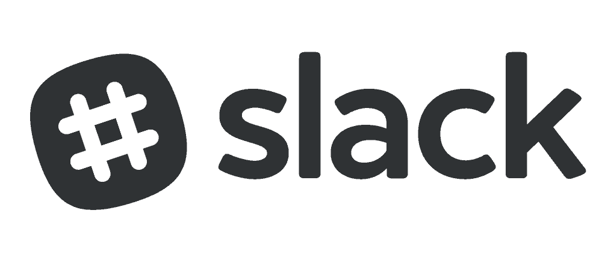
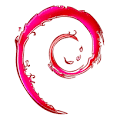
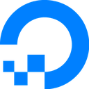
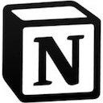
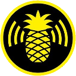
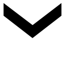
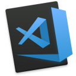

# All the  Things

<!-- Image from: https://www.groovypost.com/wp-content/uploads/2018/06/slack-logo-feature-1000x450.png -->

## Sidebar Custom Theme

Head to: Preferences > Sidebar > Custom Theme

Copy and paste these values to share your custom theme with others:
#182E40,#FFC600,#1D425D,#FFFFFF,#988026,#FFFFFF,#2CDB00,#FEBD29

## Slack Emojis

Check out some slack emojis [here](https://github.com/nicksocha/slack/tree/master/docs/slack-emojis).

|                                                                                    Emoji                                                                                    | Name            |
| :-------------------------------------------------------------------------------------------------------------------------------------------------------------------------: | :-------------- |
|                  | android         |
|                | android2        |
|                | android3        |
|            | appleinc        |
|                          | aws             |
|            | azure-2017      |
|                | bb8flame        |
|                    | chewie          |
|                    | chrome          |
|                  | codepen         |
|                    | debian          |
|        | digitalocean    |
|                  | discord         |
|                    | docker          |
|                        | edge            |
|                  | firefox         |
|        | freecodecamp    |
|                    | gatsby          |
|                          | gcp             |
|                          | git             |
|                        | git2            |
|                    | github          |
|              | gitkraken       |
|                      | gmail           |
|                    | golang          |
|                    | google          |
|                    | heroku          |
|    | homerdisappear  |
|                            | js              |
|                | lastpass        |
|            | lightsaber      |
|                | linkedin        |
|              | microsoft       |
|                        | mint            |
|                  | netlify         |
|                        | node            |
|                    | notion          |
|              | oh-my-zsh       |
|    | pineapple_hak5  |
|            | powershell      |
|                  | pycharm         |
|                    | python          |
|                      | react           |
|                | remotive        |
|      | stackoverflow   |
|                | startrek        |
|                | starwars        |
|        | stormtrooper    |
|                        | that            |
|                        | this            |
|  | thumbsup-parrot |
|                    | trello          |
|                    | twitch          |
|                  | twitter         |
|            | typescript      |
|            | virtualbox      |
|                    | vmware          |
|                    | vscode          |
|                  | vscode2         |
|                  | vscode3         |
|                  | vscode4         |
|                          | vue             |
|                          | why             |
|              | wordpress       |
|                        | yoda            |
|                  | yubikey         |
|                    | zapier          |
